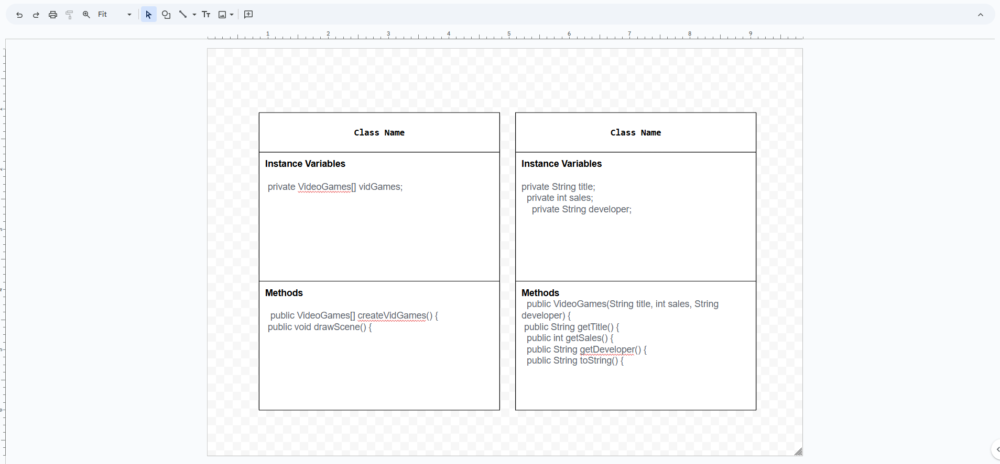
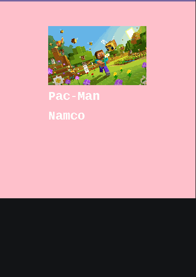

# Unit 4 - Abstract Art Project

## Introduction

Data visualizations are powerful tools to present information and convey patterns and relationships. Sometimes visualizations are charts or graphs, and other times they are more abstract pieces of art. Your goal is to create a visual representation relating at least two categories from your dataset that engages your viewer and encourages them to learn more about your chosen topic.

## Requirements

Use your knowledge of object-oriented programming, one-dimensional (1D) arrays, and algorithms to create your data visualization program:

- **Create at least two 1D arrays** – Create at least two 1D arrays to store the data that will make up your visualization.
- **Implement one or more algorithms** – Implement one or more algorithms that use two-way or multi-selection statements with compound Boolean expressions to analyze the data.
- **Use methods in the Math class** – Use one or more methods in the Math class in your program, such as to perform calculations on the values in your dataset and display the results, choose random values from the dataset, or display images or shapes at random locations.
- **Create a visualization** – Create an image or animation that conveys the story of the data by illustrating the patterns or relationships in the data.
  Note: This may be abstract! Others do not necessarily need to know what the story or pattern is right away, but you do need to be able to explain it to them.
- **Document your code** – Use comments to explain the purpose of the methods and code segments and note any preconditions and postconditions.

## Dataset

Include a hyperlink to the source of your dataset used for this project. Additionally, provide a short description of each column used from the dataset, and the data type.

Example:

Dataset: https://www.kaggle.com/datasets/sansuthi/global-co2-emissions

- **Country** (String) - name of the country
- **Population** (int) - number of people in the country
- **CO2Emissions** (double) - carbon dioxide emission in kilotons

## UML Diagram

Put and image of your UML Diagram here. Upload the image of your UML Diagram to your repository, then use the Markdown syntax to insert your image here. Make sure your image file name is one work, otherwise it might not properly get display on this README.

## Video Demo

Record a short video of your abstract art animation to display here on your README. You can do this by:

- Screen record your project running on Code.org.
- Upload that recording to YouTube.
- Take a thumbnail for your image.
- Upload the thumbnail image to your repo.
- Use the following markdown

## Description

This project is a fun way to display video game sales data using graphics. It has two main parts: the `VideoGames` class, which stores details like the game title, sales, and developer, and the `DataScene` class, which shows the data on screen. The program reads from three text files (title.txt, developer.txt, and sales.txt) and creates a visual scene for each game. The background color and text change based on the sales of the game. Games with higher sales show positive messages, while games with lower sales show different, more negative messages. The user doesn’t need to input anything, but if they could, the program might let them filter or sort the data. Overall, this project combines cool graphics with video game data to make it easy to compare how successful different games are.